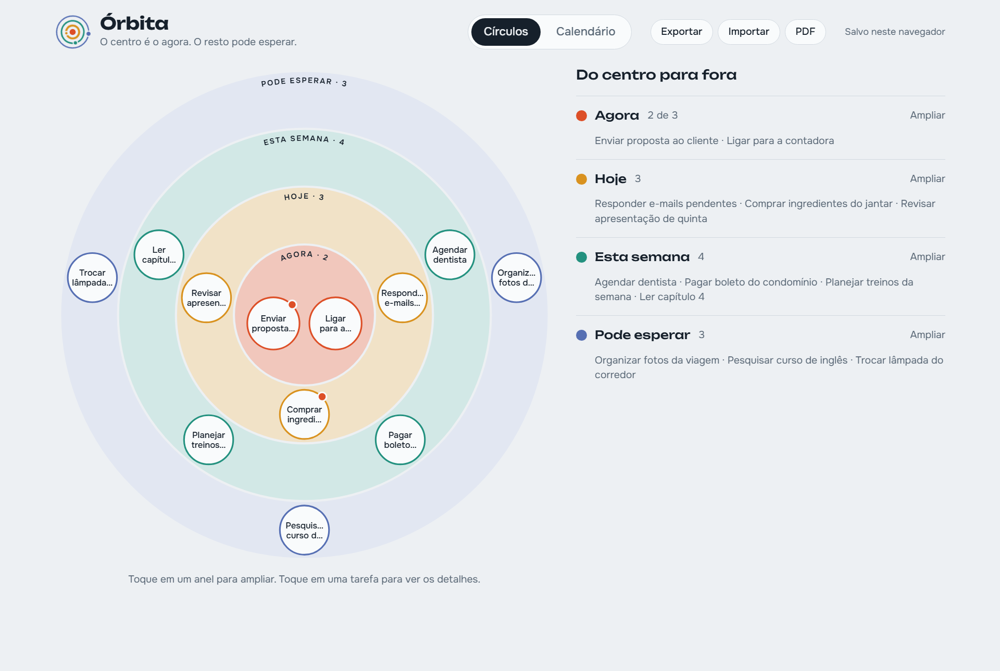
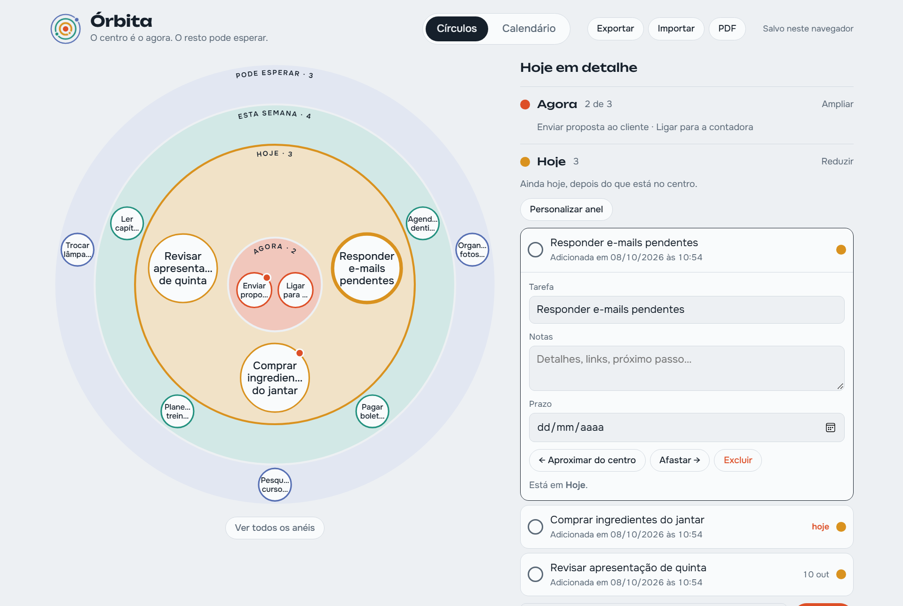
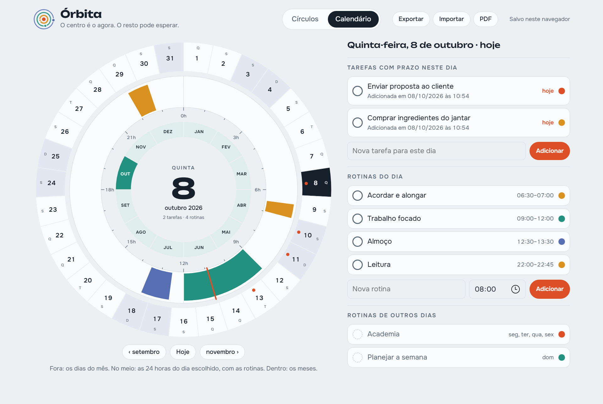

# Órbita

Tarefas e rotinas em círculos concêntricos: o centro é o que importa agora, e os anéis de fora são o que pode esperar. Tem também um calendário circular com os dias do mês, as 24 horas do dia e as rotinas.

| Um anel ampliado | Calendário circular |
| --- | --- |
|  |  |

- **Site:** https://joaogabrielmontinirossi-sys.github.io/orbita/
- **Celular:** abra o site no navegador do celular e escolha "Adicionar à tela inicial" (Android: menu ⋮ do Chrome; iPhone: botão Compartilhar do Safari). Funciona sem internet depois da primeira abertura.
- **Windows:** baixe o `Orbita.exe` na página de [Releases](https://github.com/joaogabrielmontinirossi-sys/orbita/releases). Ele abre o app numa janela própria e usa o Microsoft Edge que já vem no Windows.

## Personalização dos anéis

Amplie um anel e toque em **Personalizar anel** para mudar o nome, a descrição e a cor, criar um anel novo depois dele ou removê-lo (de 2 a 6 anéis). No centro também dá para escolher quantas tarefas cabem (de 1 a 5). A personalização acompanha a sincronização, a exportação e o PDF.

## Sincronização

No app de Windows, o botão **Sincronização** grava o arquivo `orbita-sync.json` numa pasta do Google Drive a cada alteração. Outro computador com o Órbita e o mesmo Drive recebe tudo automaticamente; alterações feitas nos dois lados são mescladas item por item.

No site e no celular os dados ficam no navegador daquele aparelho. Para levá-los a outro aparelho, use **Exportar** (gera um arquivo `orbita-AAAA-MM-DD.json`; no celular abre o menu de compartilhar) e, no outro, **Importar**. A importação mescla com o que já existe: fica a versão mais recente de cada tarefa e rotina.

O botão **PDF** gera um resumo para quem não tem o app: os círculos com as tarefas numeradas, as listas de cada anel com notas e prazos, e a tabela de rotinas por dia da semana.

Cada tarefa mostra a data e a hora em que foi adicionada e, depois, concluída. A lista de concluídas tem o botão **Exportar tabela (PDF)**, com tarefa, anel, adicionada, concluída e quanto tempo levou.

## Código

- `index.html`, `sw.js`, `manifest.webmanifest`, `icons/`: o site publicado.
- `src/orbita.html`: a fonte do app. `src/build.ps1` gera o site, os ícones e compila `src/windows/Orbita.cs` com o compilador C# que já vem no Windows.
